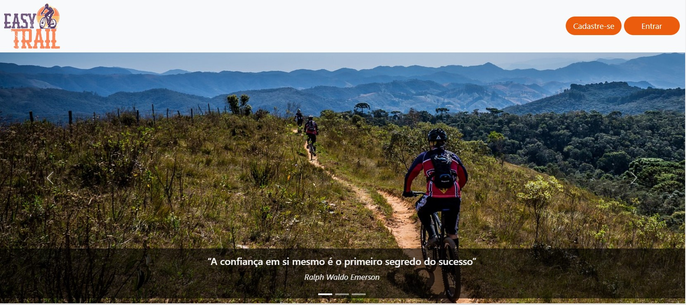
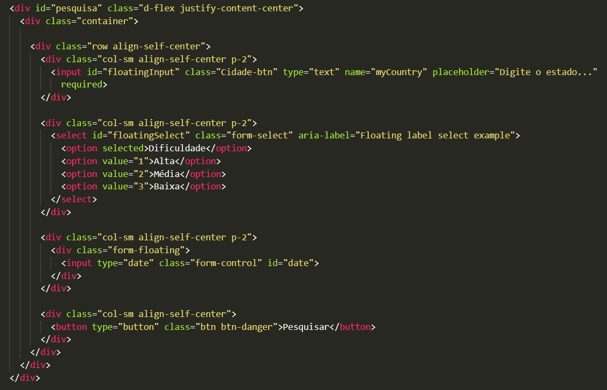
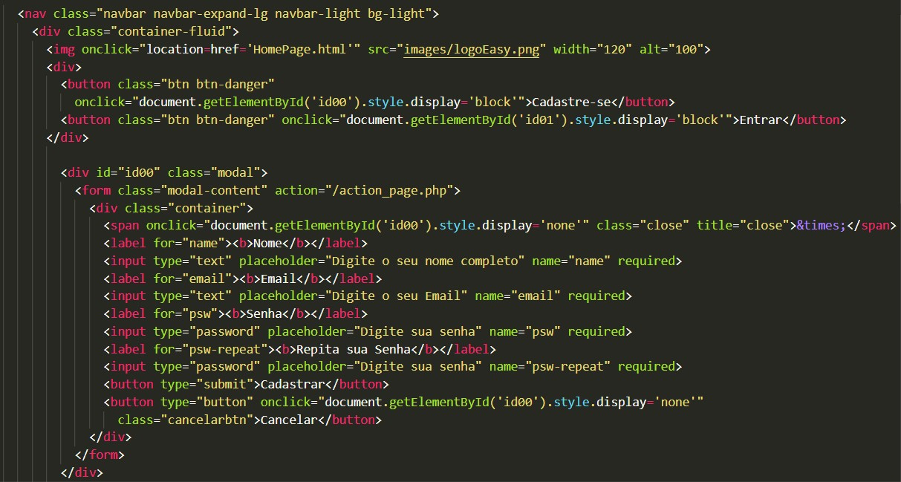
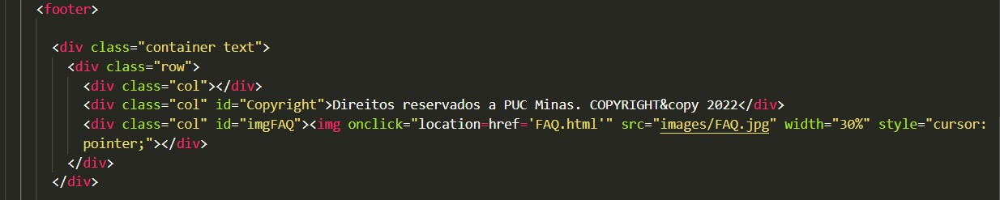
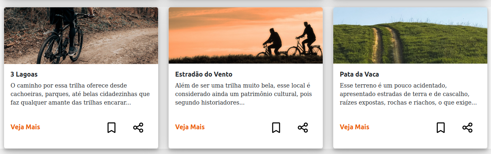
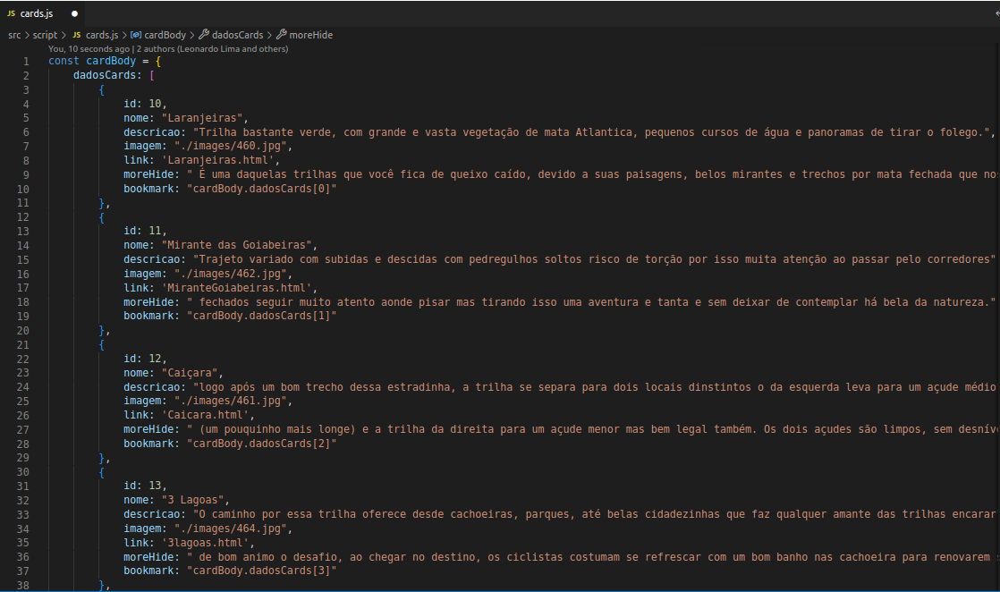

# Programação de Funcionalidades

Pré-requisitos: <a href="02-Especificação do Projeto.md"> Especificação do Projeto</a>, <a href="04-Projeto de Interface.md"> Projeto de Interface</a>, <a href="03-Metodologia.md"> Metodologia</a>, <a href="05-Arquitetura da Solução.md"> Arquitetura da Solução</a>

Abaixo temos a descrição das funcionalidades criadas por cada integrante da equipe do projeto, com exposição dos códigos e das imagens do html implementado.

# Funcionalidades:

## 1- Carlos José
`Carrossel`

.jpg)
.jpg)

## 2- Leonardo Lima
`Filtro Pesquisa`

.jpg)

`Veja Mais`

.jpg)

`Cadastre-se`

.jpg)

`Entrar`

.jpg)

`Footer FAQ`

.jpg)

`Accordion FAQ`

.jpg)

`Breadcrumb`

.jpg)

`FullScren Map`

.jpg)

`List Group`

.jpg)

## 3- Leonardo Buck
`Cards`

`Cards favoritas (adicionar)`

`Configurações do usuário`

`Card favorita (Remover e exibição)`

`Botão Compartilhar`

## 4- Rafael Santana
`Cadastro de Trilhas`

.png)

## 5- Diogo Silva
`Formulário`

